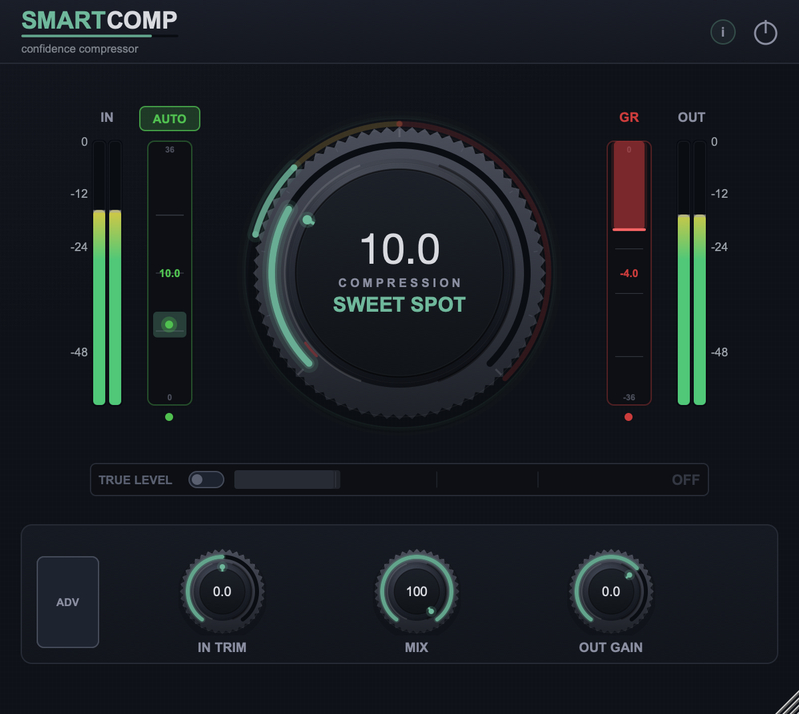
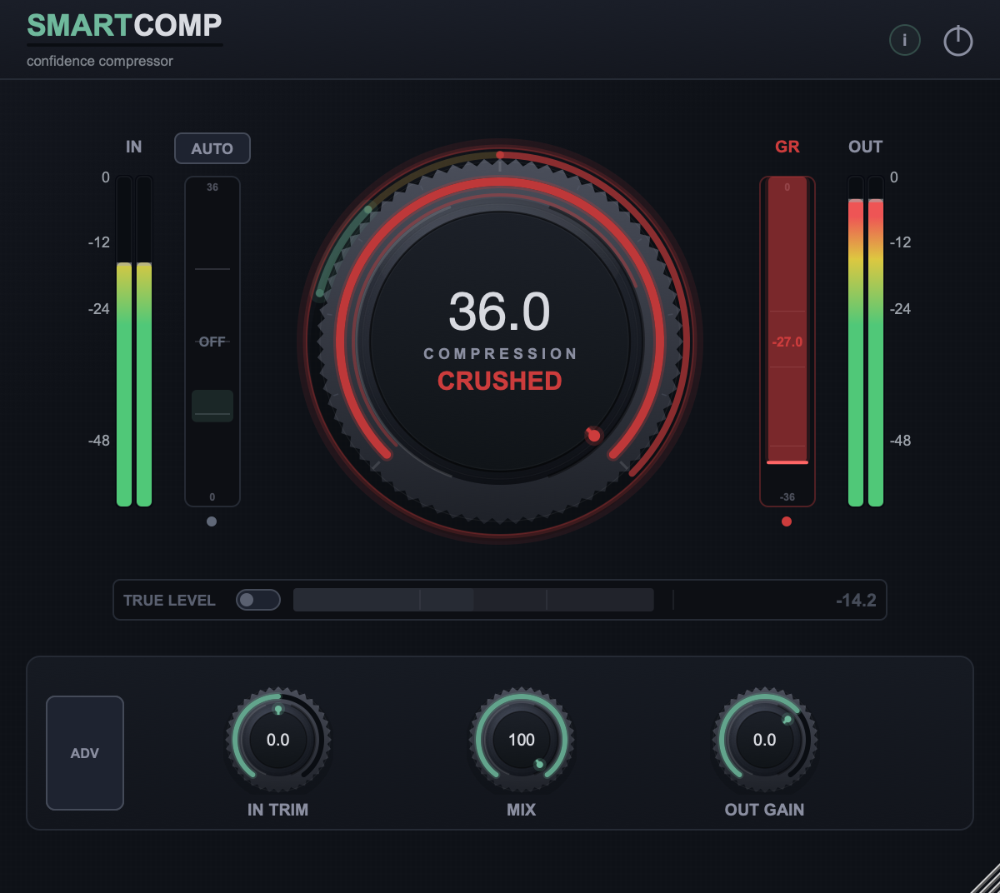

# SmartComp

Free one-knob compressor for macOS (VST3/AU) that finds its own sweet spot —
and, turned all the way up, stops being polite about it.



## How it works

The knob has two halves, and they behave differently on purpose.

**Bottom two thirds — a compressor that leaves the loudness alone.**

Most compressors need setting up before the knob does anything useful: park the
threshold at a fixed dBFS value and a quiet take sits below it doing nothing
while a hot one slams. This one measures how loud the material is running and
places its threshold relative to that, so a quietly recorded vocal and a hot one
get roughly the same amount of compression at the same knob position — measured,
within about 1.5 dB across a 15 dB range of source level. You can start turning
without setting anything up first.

And whatever loudness it takes out, it puts back automatically — not estimated
from the threshold and ratio, but *measured*, as K-weighted energy either side
of the compressor. So turning the knob up here does not make anything louder.
The dynamics tighten, the sound gets denser and steadier, and the level stays
where it was.

**Top third — the wall.**

From knob 24 up it stops restoring the level and starts deliberately driving
into its own brickwall limiter: the threshold goes deeper, the detector window
shortens, and the release lengthens so the gain holds instead of springing back
between hits. The result is dense, loud and sitting on the ceiling. On a drum
loop the short-term level swing goes from 14.2 dB in to 5.6 dB out with the
peaks on the ceiling. The readout says CRUSHED for a reason.



Below knob 24 none of that is active, so the gentle range is untouched by it.

**AUTO** drives the knob to where the compressor is delivering 3 to 5 dB on
peaks — the usual place for a vocal — and follows the material. Drag the knob
away and it holds while the mouse is down, then pulls back like a rubber band
when you let go, harder the further you dragged it. It parks well below where
the wall starts, so switch AUTO off if you want to hear the top.

The sweet spot is a claim about gain reduction, not about knob position: its
edges are where the compressor actually delivers 3 and 5 dB, and `auto_probe`
measures both every run.

## What that gets you

**You can hear what the compressor is doing, not just that it got louder.**
This is the real point. On almost any compressor, turning it up makes it louder,
and louder always sounds better at first — you turn it up, you like it, and the
next day the track is flat. Here the level stays put through the working range,
so if it sounds better as you turn up, it is because it sounds better.

**No gain staging first.** Drop it on the track and turn the knob. The position
means roughly the same thing on every source.

**AUTO finds the spot for you** and keeps following it as the performance
changes.

**And the top third is an effect, not an accident.** When you want a drum loop
or a bus genuinely crushed, that is where you go. It gets a lot louder up there
on purpose — which is what TRUE LEVEL is for: it takes that loudness advantage
back out so you can judge what the wall is doing to the sound rather than how
loud it is.

Short version: a tool at the bottom, an effect at the top, one knob.

## How new is this?

The ingredients are not new. The combination, as far as I could establish, is.

Automatic makeup gain is everywhere — but it is almost always *calculated* from
the threshold and ratio rather than measured. FabFilter's own Pro-C manual calls
its version "an educated guess" that you may need to correct by hand; Tokyo Dawn
Labs refuse to ship one at all and say why in print. A makeup that actually
measures the loudness it is replacing is ahead of what the category normally
does.

Loudness matching for fair A/B exists too — iZotope ships it, for one. But as a
separate feature alongside the makeup, not interlocking with it.

What I could not find anywhere is both behaviours on **one** knob: a compressor
that holds measured loudness constant through its working range, and the same
knob turning into a limiter wall at the top. sonible splits exactly these two
behaviours across two products — their compressor has auto gain and no match
switch, their limiter has the match switch and no auto gain. And the best-known
one-knob compressor in this category, Waves RVox, has no answer to the
comparison problem at all: its manual suggests ganging two faders together.

So not "nobody has done this", but: the pieces are known, and assembled this way
I have not found it.

## Signal chain

```
In Trim → Compressor (auto-threshold, gate, 2x oversampled) → Makeup
   → TRUE LEVEL → Limiter → Dry/Wet Mix → Out Gain
```

The limiter's ceiling is fixed at −0.3 dBFS and it holds it to within 0.03 dB.
Through the lower two thirds of the knob it does nothing at all; the wall is
the only thing that drives into it. Reported latency is 158 samples at
44.1 kHz (3.58 ms), fully compensated for the dry/wet mix and for bypass.

## Controls

| Control | Range | What it does |
|---|---|---|
| **Compression** | 0–36 | The main knob. Auto-tracking threshold and ratio; a wall above 24. |
| **AUTO** | on/off | Drives the knob to the sweet spot and keeps following it. |
| **TRUE LEVEL** | on/off | Holds output loudness equal to the input, so you can compare settings — or the plugin against bypass — without the louder one winning by being louder. The figure beside it reads in both states: engaged it is what the match is applying, disengaged it is what engaging it would cost. Below knob 24 that is a fraction of a dB, because the makeup already holds loudness there; at the top of the knob it is the wall's 14 to 16 dB. |
| **Gate** | −80 to −20 dB | Noise gate, off at minimum. Its threshold is drawn on the input meter, with the current attenuation next to it. |
| **SC HP Filter** | 0–400 Hz | High-pass on the detector only, so bass does not pump the gain reduction. The panel draws its actual response. |
| **Mix** | 0–100% | Parallel compression blend, latency-compensated. |
| **In Trim** | ±12 dB | Input gain, ahead of the detector. |
| **Out Gain** | −24 to +12 dB | True output level, applied after everything. Not the limiter ceiling. |
| **Bypass** | — | Latency-compensated, click-free. |

AUTO and TRUE LEVEL are buttons on the interface rather than automatable
parameters. Everything else is exposed to the host.

## Requirements

- macOS (Apple Silicon or Intel)
- A VST3 or Audio Unit host (Ableton Live, Logic Pro, etc.)

## Install

No signed release yet — see [INSTALL.md](INSTALL.md) for how to remove
macOS's quarantine flag from an unsigned build.

Prebuilt binaries will appear under
[Releases](https://github.com/frankknebeljanssen-create/SmartComp/releases)
once available. Until then, build from source below.

## Building from source

Requires CMake 3.15+ and Xcode command line tools.

```bash
git clone https://github.com/frankknebeljanssen-create/SmartComp.git
cd SmartComp
./build_and_install.sh
```

This clones [JUCE](https://github.com/juce-framework/JUCE) into
`~/Library/Caches/SmartComp-juce` (kept outside the repo and outside any
Dropbox-synced folder — a synced build directory causes CMake cache
conflicts), builds the plugin, and installs the VST3 to
`~/Library/Audio/Plug-Ins/VST3/`. The AU and standalone builds are produced but
not installed.

## Measuring instead of guessing

Claims about how this thing behaves are checked against the real code, because
on this project reasoning about the DSP and porting it to Python have both
produced wrong numbers. Three harnesses, all runnable:

`tests/dsp_bench.cpp` exercises the DSP classes directly — limiter ceiling,
transient response, delivered time constants, and whether a knob position
means the same thing at different source levels.

```bash
cmake --build ~/Library/Caches/SmartComp-build --target dsp_bench
~/Library/Caches/SmartComp-build/dsp_bench_artefacts/Release/dsp_bench
```

`tests/density_probe.cpp` drives the whole processor and asks what comes out
over time: short-term loudness spread, how far the plugin's own gain swings,
how close the output gets to the ceiling, whether the result depends on how
hot the source was, and what the drive does to a room bed in the pauses. Two
reference rows bracket what is reachable on the material at all — the limiter
driven hard, and a perfect 20 ms AGC.

```bash
cmake --build ~/Library/Caches/SmartComp-build --target density_probe
~/Library/Caches/SmartComp-build/density_probe_artefacts/Release/density_probe
```

`tests/auto_probe.cpp` is a behavioural test for AUTO: that the knob converges
on the sweet spot, that the band's edges deliver the 3 and 5 dB they promise,
that a drag holds while the mouse is down and pulls back when it is released,
and that parking the knob in the red with AUTO off recovers rather than
sticking.

```bash
cmake --build ~/Library/Caches/SmartComp-build --target auto_probe
~/Library/Caches/SmartComp-build/auto_probe_artefacts/Release/auto_probe
```

The screenshot above is generated the same way rather than mocked up:
`tests/ui_shot.cpp` runs the real processor and editor through a genuine JUCE
event loop against a synthetic vocal, then saves what actually renders.

```bash
cmake --build ~/Library/Caches/SmartComp-build --target ui_shot
# at rest: AUTO on, knob snapped into the sweet spot
open ~/Library/Caches/SmartComp-build/ui_shot_artefacts/Release/ui_shot.app --args /tmp/screenshot.png
# a fixed knob position instead, with AUTO off so it stays there
open ~/Library/Caches/SmartComp-build/ui_shot_artefacts/Release/ui_shot.app --args /tmp/wall.png 36
```

## Known limits

Driven hard, the wall lifts whatever is in the pauses along with the music. A
room bed at −70 dBFS still sits 48 dB under the words and one at −60 dBFS
38 dB under, both comfortably out of the way. At −50 dBFS the protection
cannot keep up and the gap closes to 7 dB. Gate it, or back the knob off.

## License

Not yet decided. The repository is public for now; no license has been
granted for reuse. This section will be updated before the first release.

## Companion plugin

SmartLim, a matching limiter, is planned as the second half of a set.
